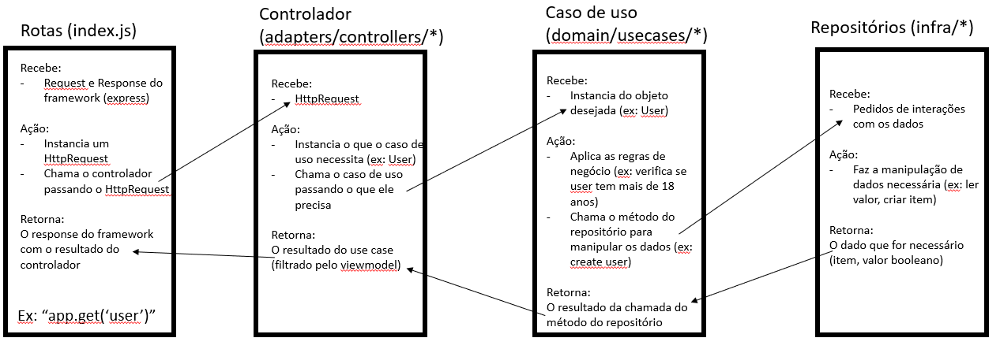
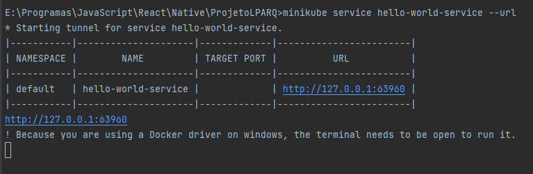

# ProjetoLPARQ

## Overview
Este é um repositório para o projeto das disciplinas ECM 516 - Arquitetura de Sistemas Computacionais e ECM 252 - Linguagens de Programação II.

O tema geral para o projeto é: **soluções computacionais para problemas causados
por guerras.**

## Integrantes

| Nome        | RA           | 
| ------------- |:-------------:| 
| Bruno Vilardi Bueno | 19.00331-5 | 
| Fernando Oliveira de Souza      | 19.00617-9 | 
| Gustavo Zamboni do Carmo | 19.01266-7 | 

## Video mostrando o funcionamento
 

## Proposta

A proposta do projeto é desenvolver um app para ajudar refugiados encontrar casas que possam os abrigar.

## Ferramentas

- Versionamento de código: [GitHub](https://github.com/)
- Linguagem de Programação: [JavaScript](https://www.javascript.com/)
- Engine do back end: [Node.js](https://nodejs.org/)
- Framework para desenvolvimento das APIs: [Express.js](https://expressjs.com/)
- Gerenciamento e documentação das APIs: [Postman](https://www.postman.com/)
- Testes de integração: [Jest](https://jestjs.io/) + [Github Actions](https://github.com/features/actions)
- Desenvolvimento do UI (Parte 1): [Angular](https://angular.io/)
- Desenvolvimento do UI (Parte 2): [React](https://reactjs.org/)

## Arquitetura

A arquitetura do app é composta por 2 microsserviços ([nodeJS](https://nodejs.org/)) e 1 front end (Parte 1) [Angular](https://angular.io/) (Parte 2) [React](https://reactjs.org/).
- Microsserviço de gerenciamento de usuarios: **`/back-end/mss_gerenciamento_usuarios`**
  - Documentação: [link](https://documenter.getpostman.com/view/16858667/Uyr5of2L)
  - Diretório: [shortcut](https://github.com/PropysMaua/ProjetoLPARQ/tree/main/back-end/mss_gerenciamento_usuarios)
- Microsserviço de Busca
- Front-end (Parte 1): **`/lparq-front`**
- Front-end (Parte 2): **`/front-react`**

## Back End

### Arquitetura
A arquitetura do back-end é baseada na seguinte interpretação de Clean Architecture:

## Como rodar o projeto

### Buildar o projeto

    docker-compose build

### Rodar o projeto

    docker-compose up

### Alternativa: usar o script para execução (Windows)

    run-docker.bat

### Usando Kubernetes: (minikube + kubectl devem estar instalados)

    run-kubernetes.cmd

### Visualizando o service no kubernetes 

    minikube service hello-world-service --url

## Video Explicativo do projeto relacionado a parte 2

